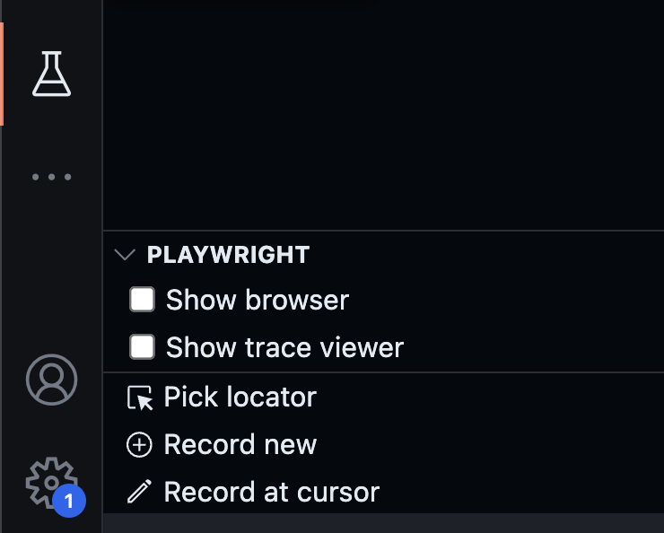

# Test Automation Example

We will be using Playwright to automate the tests. Please refer to the [documentation](https://playwright.dev/docs/intro) for additional information.

## Quick Start

Make sure you have the required dependencies installed, so you can run the tests correctly.

### Core Dependencies:

- Node.js
  - Download and install [Node](https://nodejs.org/en).
- Yarn
  - Check if Node and NPM are installed correctly by running `node -v` and `npm -v`
  - Install Yarn by running `npm i -g yarn`

### Installing Test Dependencies

Command:

```bash
yarn
```

### Running Test Examples

Command:

```bash
yarn test
```

Test should start using UI mode which allows you to follow along.
You can decrease the test speed by tweaking the value of the property `slowMo` in the `playwright.config.js` file.

### Recommendations

I recommend using [Visual Studio Code](https://code.visualstudio.com/) along with the [Playwright Test for VSCode](https://marketplace.visualstudio.com/items?itemName%253Dms-playwright.playwright) extension.

The extension allows you to record all interactions with the Website / Application you are testing generating a test scenario automatically.
The result is not perfect, but it helps to get up to speed with the tool.


